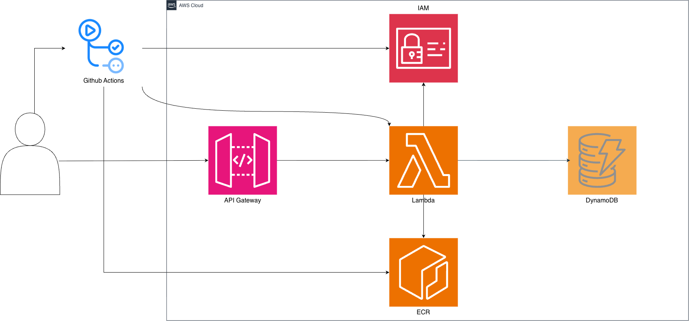
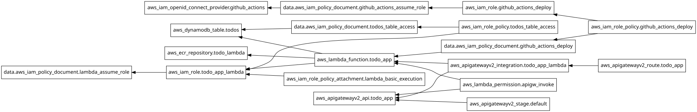

# serverless-architecture-terraform

[한국어](./README.md) | **日本語**

AWS サーバーレスアーキテクチャを Terraform でプロビジョニングし、GitHub Actions でデプロイを自動化したプロジェクト

**このリポジトリのテーマは、インフラ構成とデプロイパイプラインです。** アプリケーションはインフラを検証するための最小限の CRUD API とし、Terraform コードとデプロイ構造に焦点を当てました。

構築過程と技術選定の根拠は、以下のドキュメントにまとめています。(いずれも韓国語で執筆)

|      | ドキュメント                                                 | 内容                                     |
| ---- | ------------------------------------------------------------ | ---------------------------------------- |
| ①    | [Lambda と DynamoDB を選んだ理由](https://medium.com/@gumtiket0303/lambda%EC%99%80-dynamodb%EB%A5%BC-%EC%84%A0%ED%83%9D%ED%95%9C-%EC%9D%B4%EC%9C%A0-15993a76aa98) | 技術選定の根拠とトレードオフ             |
| ②    | [Terraform、これだけ知って始めよう](https://medium.com/@gumtiket0303/terraform-%EC%9D%B4%EA%B2%83%EB%A7%8C-%EC%95%8C%EA%B3%A0-%EC%8B%9C%EC%9E%91%ED%95%98%EC%9E%90-d5293100442d) | provider、state、init/plan/apply/destroy |
| ③    | [サーバーレスアーキテクチャを Terraform で](https://medium.com/@gumtiket0303/%EC%84%9C%EB%B2%84%EB%A6%AC%EC%8A%A4-%EC%95%84%ED%82%A4%ED%85%8D%EC%B2%98%EB%A5%BC-terraform%EC%9C%BC%EB%A1%9C-3b23aac39e0c) | リソースごとの構成と依存関係             |
| ④    | [サーバーレスアーキテクチャを Terraform で 2](https://medium.com/@gumtiket0303/%EC%84%9C%EB%B2%84%EB%A6%AC%EC%8A%A4-%EC%95%84%ED%82%A4%ED%85%8D%EC%B2%98%EB%A5%BC-terraform%EC%9C%BC%EB%A1%9C-2-69f6396001a8) | GitHub Actions OIDC によるデプロイ       |

---

## アーキテクチャ



クライアントからのリクエストは API Gateway(HTTP API)を経由して Lambda に渡されます。Lambda は DynamoDB にアクセスしてデータを処理します。

デプロイは、main ブランチに push すると GitHub Actions がテストを実行し、通過した場合にのみイメージをビルドして ECR にアップロードし、Lambda が新しいイメージを使用するよう更新します。

---

## 技術スタック

| 構成要素       | 選択                        | 理由                                                         |
| -------------- | --------------------------- | ------------------------------------------------------------ |
| コンピューティング | Lambda(コンテナイメージ)  | リクエスト単位で実行、アイドル時のコストなし                 |
| データベース   | DynamoDB(オンデマンド)      | Lambda の並列実行環境における接続維持の問題を回避            |
| API            | API Gateway HTTP API        | Lambda プロキシ統合、REST API に比べてシンプルで低コスト     |
| IaC            | Terraform                   | 構成のコード化と変更履歴の追跡                               |
| CI/CD          | GitHub Actions + OIDC       | 長期アクセスキーなしで、一時的な認証情報を使ってデプロイ     |

RDBMS を選ばなかった理由は、①のドキュメントにまとめています。要約すると、Lambda はリクエストが集中すると実行環境を増やして並列処理するため、コネクションプールを前提とする RDBMS とは相性が良くありません。RDS Proxy で緩和することはできますが、接続管理のレイヤーが増え、データベース側の接続数の上限そのものは解決されません。DynamoDB は接続を維持せず HTTPS API 呼び出しで動作するため、この問題を回避できます。

ただし、現在の取得ロジックである `scan` は、データが増えると非効率になります。これはサービスの規模を考慮したうえで、許容した選択です。

---

## リソース依存関係グラフ



---

## IAM 権限設計

Lambda 実行ロールと GitHub Actions デプロイロールを分離しました。前者は関数の動作に必要な権限のみを、後者はデプロイに必要な権限のみを持ちます。

*Lambda が同じアカウントの ECR イメージを使用する場合、別途 ECR 権限は不要です。*

デプロイロールの権限はアクション単位で分離し、push 権限は ECR リポジトリの ARN に、更新権限は Lambda 関数の ARN に絞り込みました。
ただし、`ecr:GetAuthorizationToken` は特定のリポジトリへアクセスする権限ではなく、認証トークンを発行する権限であるため、リソース単位での制限ができません。そのため、この statement は分離して `resources = ["*"]` を適用しました。

OIDC Provider の client_id_list と信頼ポリシーの aud 条件は同じ値を検査しますが、適用されるレイヤーが異なります。これにより、Provider の設定が変更されても、ロールの制限を維持できます。

---

## ディレクトリ構成

```
.
├── .github/
│   └── workflows/
│       └── deploy.yml    
├── images/
│   ├── architecture.png
│   └── graph.svg 
├── infra/                 
│   ├── provider.tf         
│   ├── variables.tf      
│   ├── api_gateway.tf     
│   ├── lambda.tf         
│   ├── dynamodb.tf       
│   ├── ecr.tf             
│   ├── iam.tf           
│   ├── github_oidc.tf
│   ├── terraform.tfvars.example             
│   └── outputs.tf                  
├── src/                  
│   ├── app.py               
│   └── todos.py            
├── tests/
│   ├── test_app.py
│   └── test_todos.py
├── conftest.py
├── Dockerfile
├── requirements.txt
└── requirements-dev.txt
```

---

## 実行方法

### 0. 注意事項

1. `terraform.tfvars.example` をご自身の値で埋め、`terraform.tfvars` にリネームしてください。`github_owner_id` と `github_repo_id` は、以下のコマンドで取得できます。

   ```bash
   curl -sL https://api.github.com/users/{OWNER} | grep -m1 '"id"'
   curl -sL https://api.github.com/repos/{OWNER}/{REPO} | grep -m1 '"id"'
   ```

2. アカウントにすでに GitHub OIDC Provider が存在する場合、apply に失敗することがあります。`aws_iam_openid_connect_provider` リソースを削除し、既存の Provider の ARN を参照するよう修正してください。

3. デフォルトのリージョンは `ap-northeast-2` です。変更が必要な場合は、provider.tf とステップ 2 のログインコマンドを修正してください。

4. ECR にイメージが残っていると `terraform destroy` が失敗します。

### 1. インフラのプロビジョニング

```bash
cd infra
terraform init
terraform plan
terraform apply
```

> 注意: ECR に `latest` タグのイメージがないと、Lambda の作成段階で失敗します。
> ただし、ECR は依存関係がないため、apply が失敗しても作成されます。
> 以下の手順でイメージを先にアップロードしてから apply してください。

### 2. 初回イメージのアップロード

```bash
# ECR のアドレスを確認
terraform output ecr_repository_url

# ログイン
aws ecr get-login-password --region ap-northeast-2 \
  | docker login --username AWS --password-stdin <ECR_REGISTRY>
  
# ビルドとプッシュ
docker build --platform linux/amd64 --provenance=false --sbom=false -t todo-lambda .
docker tag todo-lambda:latest <ECR_REGISTRY>/todo-lambda:latest
docker push <ECR_REGISTRY>/todo-lambda:latest
```

> 上記の方法で解決しない場合は、
> ① Docker Desktop アプリ → Settings → General → 「Use containerd for pulling and storing images」のチェックを外す → Apply & restart

### 3. 適用

``` bash
terraform apply
```

### 4. GitHub Actions の設定

リポジトリの Secrets に、デプロイ用ロールの ARN を登録してください。

```
AWS_DEPLOY_ROLE_ARN = arn:aws:iam::<ACCOUNT_ID>:role/github-actions-deploy
# または
terraform output github_actions_deploy_role_arn
```

以降、`main` ブランチに push すると自動でデプロイされます。

---

## API

| Method | Path          | 説明     |
| ------ | ------------- | -------- |
| GET    | `/todos`      | 一覧取得 |
| POST   | `/todos`      | 作成     |
| GET    | `/todos/{id}` | 単件取得 |
| PATCH  | `/todos/{id}` | 更新     |
| DELETE | `/todos/{id}` | 削除     |

---

## トラブルシューティング

### 新しいイメージを push しても Lambda が更新されない

Lambda は、関数を作成または更新する時点で、`image_uri` のタグを実際のイメージ digest に変換して固定します。そのため、latest タグで新しいイメージを push しても、関数は以前のイメージを参照し続けます。

デプロイワークフローで `aws lambda update-function-code` を明示的に呼び出すよう構成して解決しました。

### Lambda がイメージを認識しない

Docker がイメージに provenance/SBOM attestation を追加すると manifest の構造が変わり、Lambda がイメージを正しく認識できない場合があります。

ビルド時に `--provenance=false --sbom=false` を明示して解決しました。

### 環境によってビルドされるイメージのアーキテクチャが変わる

docker build は、デフォルトではビルドを実行したマシンのアーキテクチャでイメージを作成します。そのため、ビルドする環境によってアーキテクチャが一致せず、Lambda 関数の呼び出しが失敗することがあります。

関数のアーキテクチャを x86_64 に変更し、手動ビルドと CI/CD ワークフローの両方で `--platform linux/amd64` を明示して解決しました。

### GitHub Actions で deploy が失敗する

`Not authorized to perform sts:AssumeRoleWithWebIdentity`

信頼ポリシーの `sub` 条件を旧形式で記述していたため、認証に失敗したのが原因でした。GitHub は、OIDC トークンの `sub` クレームにリポジトリ・組織の immutable ID を含めるよう形式を変更しました。リポジトリや組織の名前は変更されたり、他の主体に再利用されたりする可能性があり、名前だけでは信頼ポリシーが意図しない主体と一致してしまうおそれがあるためです。

その後、リポジトリを rename または fork した環境で、同じエラーが再発しました。owner/repo の名前と ID が、信頼ポリシーの値と一致しなくなったためです。これらの値を変数に切り出し、`terraform.tfvars` で修正するよう構成しました。

[サーバーレスアーキテクチャを Terraform で 2](https://medium.com/@gumtiket0303/%EC%84%9C%EB%B2%84%EB%A6%AC%EC%8A%A4-%EC%95%84%ED%82%A4%ED%85%8D%EC%B2%98%EB%A5%BC-terraform%EC%9C%BC%EB%A1%9C-2-69f6396001a8)(韓国語)もあわせてご参照ください。
