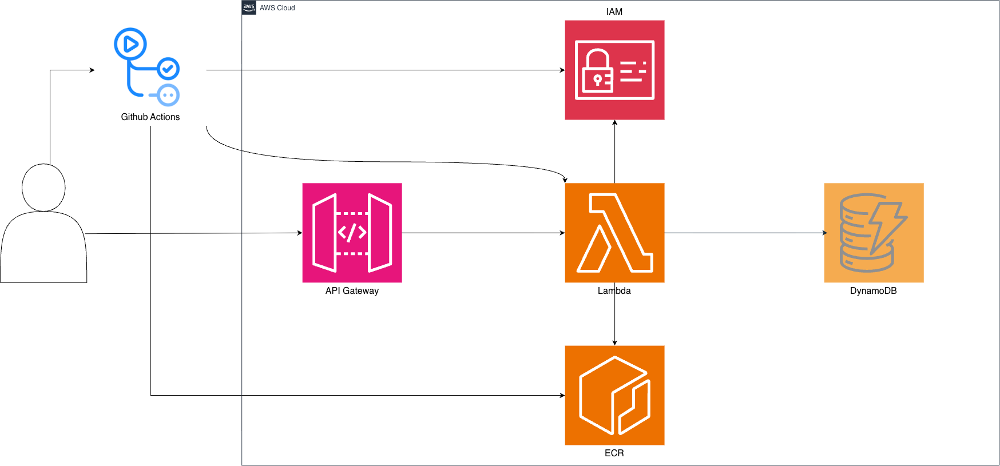
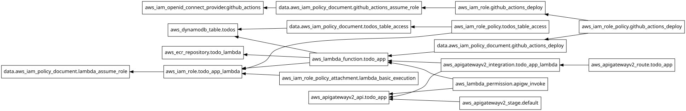

# serverless-architecture-terraform

AWS 서버리스 아키텍처를 Terraform으로 프로비저닝하고, GitHub Actions로 배포를 자동화한 프로젝트

**이 저장소의 주제는 인프라 구성 및 배포 파이프라인입니다.** 애플리케이션은 인프라의 검증을 위한 최소 CRUD API로 구성하여, Terraform 코드와 배포 구조에 집중했습니다.

구축 과정과 기술 선택의 근거는 아래 문서에 정리했습니다.

|      | 문서                                                         | 내용                                     |
| ---- | ------------------------------------------------------------ | ---------------------------------------- |
| ①    | [Lambda와 DynamoDB를 선택한 이유](https://medium.com/@gumtiket0303/lambda%EC%99%80-dynamodb%EB%A5%BC-%EC%84%A0%ED%83%9D%ED%95%9C-%EC%9D%B4%EC%9C%A0-15993a76aa98) | 기술 선택의 근거와 트레이드오프          |
| ②    | [Terraform, 이것만 알고 시작하자](https://medium.com/@gumtiket0303/terraform-%EC%9D%B4%EA%B2%83%EB%A7%8C-%EC%95%8C%EA%B3%A0-%EC%8B%9C%EC%9E%91%ED%95%98%EC%9E%90-d5293100442d) | provider, state, init/plan/apply/destroy |
| ③    | [서버리스 아키텍처를 Terraform으로](https://medium.com/@gumtiket0303/%EC%84%9C%EB%B2%84%EB%A6%AC%EC%8A%A4-%EC%95%84%ED%82%A4%ED%85%8D%EC%B2%98%EB%A5%BC-terraform%EC%9C%BC%EB%A1%9C-3b23aac39e0c) | 리소스별 구성과 의존 관계                |
| ④    | [서버리스 아키텍처를 Terraform으로 2](https://medium.com/@gumtiket0303/%EC%84%9C%EB%B2%84%EB%A6%AC%EC%8A%A4-%EC%95%84%ED%82%A4%ED%85%8D%EC%B2%98%EB%A5%BC-terraform%EC%9C%BC%EB%A1%9C-2-69f6396001a8) | GitHub Actions OIDC 기반 배포            |

---

## 아키텍처



클라이언트 요청은 API Gateway(HTTP API)를 거쳐 Lambda로 전달됩니다. Lambda는 DynamoDB에 접근해 데이터를 처리합니다.

배포는 main 브랜치에 push하면 GitHub Actions가 테스트를 실행하고, 통과한 경우에만 이미지를 빌드해 ECR에 업로드한 뒤 Lambda가 새 이미지를 사용하도록 갱신합니다.

---

## 기술 스택

| 구성 요소    | 선택                     | 이유                                                |
| ------------ | ------------------------ | --------------------------------------------------- |
| 컴퓨팅       | Lambda (컨테이너 이미지) | 요청 단위 실행, 유휴 비용 없음                      |
| 데이터베이스 | DynamoDB (On-Demand)     | Lambda의 병렬 실행 환경에서 커넥션 유지 문제를 피함 |
| API          | API Gateway HTTP API     | Lambda 프록시 통합, REST API 대비 단순·저비용       |
| IaC          | Terraform                | 구성의 코드화 및 변경 이력 추적                     |
| CI/CD        | GitHub Actions + OIDC    | 장기 액세스 키 없이 임시 자격증명으로 배포          |

RDBMS를 배제한 이유는 ①번 문서에 정리되어 있습니다. 요약하자면, Lambda는 요청이 몰릴 때 실행 환경을 늘려 병렬 처리하기 때문에 커넥션 풀 기반의 RDBMS와 어울리지 않습니다. RDS Proxy가 완화해 줄 수 있으나, 커넥션 관리 계층이 추가되고 데이터베이스의 커넥션 한계를 해결하지는 못합니다. DynamoDB는 커넥션을 유지하지 않고 HTTPS API 호출로 동작해 이 문제를 피할 수 있습니다.

다만 현재 조회 로직인 `scan`은 데이터가 늘어나면 비효율적입니다. 이는 서비스의 규모를 고려해 감수한 선택입니다.

---

## 리소스 의존성 그래프



---

## IAM 권한 설계

Lambda 실행 Role과 GitHub Actions 배포 Role을 분리했습니다. 전자는 함수가 동작하는데 필요한 권한만을, 후자는 배포에 필요한 권한만을 갖습니다.

*Lambda가 같은 계정의 ECR 이미지를 사용하는 경우 별도의 ECR 권한은 필요하지 않습니다.*

배포 Role의 권한은 액션 단위로 분리해, 푸시 권한은 ECR 레포지토리 ARN으로, 갱신 권한은 Lambda 함수 ARN으로 좁혔습니다.
다만, `ecr:GetAuthorizationToken`은 특정 레포지토리에 접근하는 권한이 아닌 인증 토큰을 발급받는 권한이기 때문에 리소스 단위 제한이 불가능합니다. 따라서, 해당 statement는 분리해 `resources = ["*"]`를 적용했습니다.

OIDC Provider의 client_id_list와 신뢰 정책의 aud 조건은 같은 값을 검사하지만 적용 계층이 다릅니다. 이를 통해 Provider 설정이 변경되어도 Role의 제한을 유지할 수 있습니다. 

---

## 디렉터리 구조

```
.
├── .github/
│   └── workflows/
│       └── deploy.yml    
├── images/
│   ├── architecture.png
│   └── graph.svg 
├── infra/                 
│   ├── provider.tf         
│   ├── variables.tf      
│   ├── api_gateway.tf     
│   ├── lambda.tf         
│   ├── dynamodb.tf       
│   ├── ecr.tf             
│   ├── iam.tf           
│   ├── github_oidc.tf
│   ├── terraform.tfvars.example             
│   └── outputs.tf                  
├── src/                  
│   ├── app.py               
│   └── todos.py            
├── tests/
│   ├── test_app.py
│   └── test_todos.py
├── conftest.py
├── Dockerfile
├── requirements.txt
└── requirements-dev.txt
```

---

## 실행 방법

### 0. 주의사항

1. `terraform.tfvars.example`을 본인의 값으로 채우고, `terraform.tfvars`로 이름을 변경해주세요.

   ```bash
   curl -sL https://api.github.com/users/{OWNER} | grep -m1 '"id"'
   curl -sL https://api.github.com/repos/{OWNER}/{REPO} | grep -m1 '"id"'
   ```

   id 값들은 위 명령으로 조회가 가능합니다.

2. 계정에 이미 GitHub OIDC Provider가 있으면 apply에 실패할 수 있습니다. `aws_iam_openid_connect_provider` 리소스를 제거하고 기존 Provider의 ARN을 참조하도록 수정해주세요.

3. 기본 리전은 `ap-northeast-2`입니다. 변경이 필요할 경우 provider.tf와 2단계의 로그인 명령을 수정해주세요.

4.  ecr에 이미지가 있으면 `terraform destroy` 가 실패합니다.

### 1. 인프라 프로비저닝

```bash
cd infra
terraform init
terraform plan
terraform apply
```

> 주의: ECR에 `latest` 태그 이미지가 없으면 Lambda 생성 단계에서 실패합니다.
> 다만, ECR은 의존성이 없어 apply가 실패해도 생성됩니다.
> 아래 순서대로 이미지를 먼저 올린 뒤 apply해 주세요.

### 2. 최초 이미지 업로드

```bash
# ECR 주소 확인
terraform output ecr_repository_url

# 로그인
aws ecr get-login-password --region ap-northeast-2 \
  | docker login --username AWS --password-stdin <ECR_REGISTRY>
  
# 빌드 및 푸시
docker build --platform linux/amd64 --provenance=false --sbom=false -t todo-lambda .
docker tag todo-lambda:latest <ECR_REGISTRY>/todo-lambda:latest
docker push <ECR_REGISTRY>/todo-lambda:latest
```

> 만약 위의 방법으로 해결이 안될 경우 
> ① Docker Desktop 앱 → Settings → General → "Use containerd for pulling and storing images" 체크 해제 → Apply & restart

### 3. 적용

``` bash
terraform apply
```

### 4. GitHub Actions 설정

저장소 Secrets에 배포용 Role의 ARN을 등록해 주세요.

```
AWS_DEPLOY_ROLE_ARN = arn:aws:iam::<ACCOUNT_ID>:role/github-actions-deploy
# 또는
terraform output github_actions_deploy_role_arn
```

이후 `main` 브랜치에 push하면 자동으로 배포됩니다.

---

## API

| Method | Path          | 설명      |
| ------ | ------------- | --------- |
| GET    | `/todos`      | 목록 조회 |
| POST   | `/todos`      | 생성      |
| GET    | `/todos/{id}` | 단건 조회 |
| PATCH  | `/todos/{id}` | 수정      |
| DELETE | `/todos/{id}` | 삭제      |

---

## 트러블슈팅

### 새 이미지를 push해도 Lambda가 갱신되지 않는 현상 

Lambda는 함수를 생성하거나 갱신하는 시점에 `image_uri`의 태그를 실제 이미지 digest로 변환해 고정합니다. 따라서 latest 태그로 새 이미지를 push해도 함수는 기존 이미지를 계속 참조합니다.

배포 워크플로우에서 `aws lambda update-function-code`를 명시적으로 호출하도록 구성하는 것으로 해결했습니다.

### Lambda가 이미지를 인식하지 못하는 현상

Docker가 이미지에 provenance/SBOM attestation을 추가하면 manifest 구조가 달라져, Lambda가 이미지를 정상적으로 인식하지 못하는 경우가 있습니다.

빌드 시 `--provenance=false --sbom=false`를 명시해 해결했습니다.

### 다양한 환경에서 이미지를 빌드할 때 아키텍쳐가 바뀌는 현상

docker build는 기본적으로 빌드를 실행한 머신의 아키텍처로 이미지를 만듭니다. 이에 빌드하는 환경에 따라 아키텍처의 불일치로 Lambda 함수 호출이 실패하는 문제가 발생할 수 있습니다.

함수 아키텍처를 x86_64로 변경하고, 수동 빌드와 CI/CD 워크플로우 모두 `--platform linux/amd64`를 명시하는 것으로 해결했습니다.

### GitHub Actions에서 deploy가 실패하는 문제

`Not authorized to perform sts:AssumeRoleWithWebIdentity`

처음에는 기존의 OIDC 토큰의 sub 클레임의 형식을 구형으로 사용해서 인증을 받지 못하는 문제가 발생했습니다.

이는 GitHub의 changelog를 확인해 수정했습니다.

그러나 다음에도 같은 이슈가 발생했습니다. 저장소를 rename하거나 fork해서 실행하는 경우 등에서 owner/repo의 이름 및 id가 불일치해서 인증을 못하게 됩니다.

이는 owner/repo까지 변수로 분리하여 수정의 편의성을 향상시켰습니다.

[서버리스 아키텍처를 Terraform으로 2](https://medium.com/@gumtiket0303/%EC%84%9C%EB%B2%84%EB%A6%AC%EC%8A%A4-%EC%95%84%ED%82%A4%ED%85%8D%EC%B2%98%EB%A5%BC-terraform%EC%9C%BC%EB%A1%9C-2-69f6396001a8)를 참고해주세요.

---


